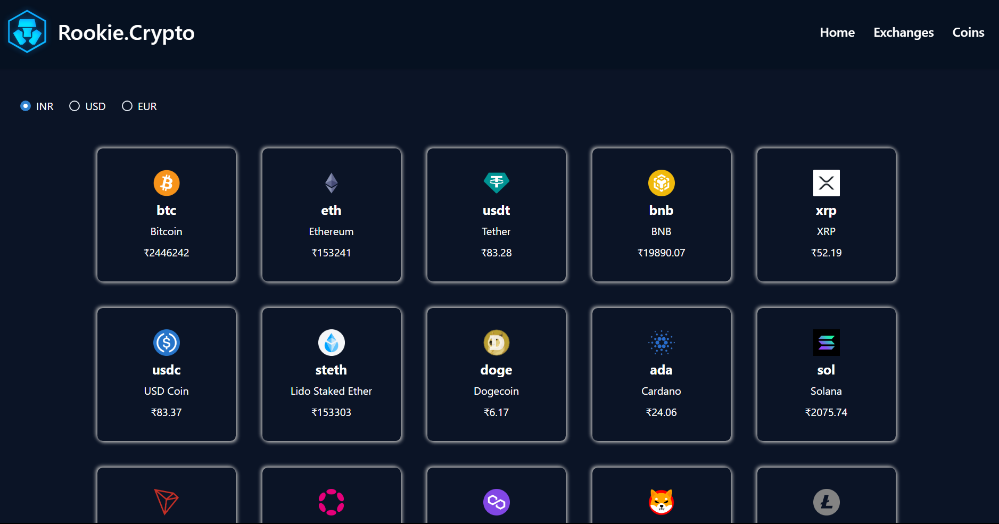

# Rookie Crypto

## Overview
Welcome to the Crypto Coin Website, your one-stop destination for real-time cryptocurrency information and insightful visualizations. This web application is developed using the Coingecko API to fetch accurate and up-to-date cryptocurrency data, and it incorporates the Chakra UI library for a attractive and responsive user interface. Explore the dynamic world of cryptocurrencies, check live prices, and visualize trends with the power of Chart.js.

## Features
* ### Coingecko API Integration: 
Our website leverages the Coingecko API to provide users with real-time data on a wide range of cryptocurrencies. Stay informed about the latest prices, market cap, trading volume, and more.

* ### Chakra UI Library: 
The Chakra UI library is employed to enhance the user interface, providing a modern and visually appealing design. Responsive components ensure a seamless experience across various devices.

* ### Live Price Tracking: 
Get instant updates on the prices of different cryptocurrencies. The website dynamically fetches and displays current market prices, allowing users to stay informed about their favorite digital assets.

* ### Interactive Charts using Chart.js:
 Visualize cryptocurrency trends and historical data using interactive charts powered by Chart.js. Gain insights into price fluctuations, trading volumes, and market trends over specific time intervals.

* ### Responsive Design: 
The website is designed to be fully responsive, ensuring a seamless user experience on desktops, tablets, and mobile devices.

## Getting Started
To run the application locally, follow these steps:

1. Clone the repository: git clone https://github.com/akashnaruka01/CryptoApp.git
2. Install dependencies: npm install
3. Obtain your Coingecko API key from <a href="https://www.coingecko.com/">Coingecko </a>  and replace it in the env file.
4. Start the development server: npm start

## Dependencies
* Chakra UI
* React.js
* Chart.js
* Axios (for API requests)
* Coingecko API

## Contributing
We welcome contributions! Feel free to submit bug reports, feature requests, or pull requests to help improve the functionality and user experience of our Crypto Coin Website.
